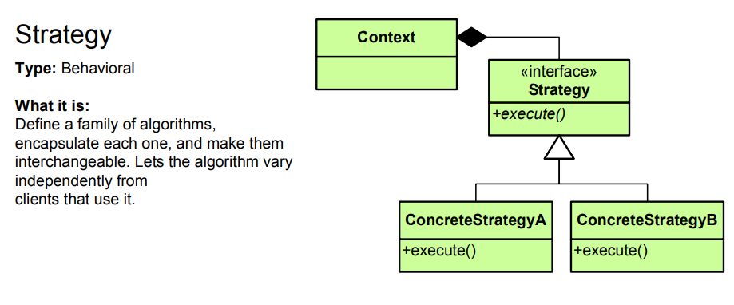

## 동작 파라미터화 코드 전달하기

동작 파라미터화를 이용하면 자주 바뀌는 요구 사항에 효과적으로 대응 할 수 있다.

#### 1. 녹색 사과 필터링
~~~java
public static List<Apple> filterGreenApples(List<Apple> inventory) {
    List<Apple> result = new ArrayList<>();
    for (Apple apple : inventory) {
        if("green".equals(apple.getColor())) {
            result.add(apple);
        }
    }
    return result;
}
~~~
녹색 사과가 아닌 빨간 사과가 필터링 하고 싶을 경우?  
다양한 색의 사과를 필터링 하고 싶을 경우?  
> _"비슷한 코드를 구현한 다음에 추상화"_  

#### 2. 색을 파라미터화
~~~java
public static List<Apple> filterApplesByColor(List<Apple> inventory, String color) {
    List<Apple> result = new ArrayList<>();
    for (Apple apple : inventory) {
        if (apple.getColor().equals(color)) {
           result.add(apple); 
        }
    }
    return result;
}
~~~
무게를 판단하는 기준이 추가된다면? 중복된 코드 없이 작성하려면?

#### 3. 가능한 모든 속성으로 필터링
~~~java
public static List<Apple> filterApples(List<Apple> inventory, String color, int weight, boolean flag) {    
    List<Apple> result = new ArrayList<>();
    for (Apple apple : inventory) {
        if ((flag && apple.getColor().equals(color)) || 
            (!flag && apple.getWeight() > weight)) {
           result.add(apple); 
        }
    }
    return result;
} 
~~~
작동은 잘하지만, 요구사항이 변경될 경우 유연하게 대응할 수 없다.

#### 4. 추상적 조건으로 필터링
~~~java
public static List<Apple> filterApples(List<Apple> inventory, ApplePredicate p) {
    List<Apple> result = new ArrayList<>();
    for (Apple apple : inventory) {
        if(p.test(apple)) {
            result.add(apple);
        }
    }
    return result;
}
~~~
전략 패턴 : 캡슐화하는 알고리즘 패밀리를 정의해둔 다음에 런타임에 알고리즘을 선택하는 기법  
   
  
해당 방법의 경우 인터페이스를 구현하는 여러 클래스를 정의한 다음에 인스턴스화해야 한다. 이는 상당히 번거로운 작업이며 로직과 관련 없는 코드도 많이 추가되게 된다.
자바는 클래스의 선언과 인스턴스화를 동시에 수행할 수 있도록 **익명클래스**라는 기법을 제공한다.

#### 5. 익명 클래스 사용
~~~java
List<Apple> redApples = filterApples(inventory, new ApplePredicate() {
    public boolean test(Apple apple) {
        return "red".equals(apple.getColor());
    }
})
~~~
익명 클래스를 사용해도 익명클래스는 여전히 많은 공간을 차지한다.
코드의 장황함은 나쁜특성이다. 장환한 코드는 구현하고 유지보수하는데 시간이 오래걸릴 뿐 아니라 읽는 즐거움을 빼앗는 요소로, 개발자로부터 외면받는다. 한눈에 이해할 수 있어야 좋은 코드다.

#### 6. 람다 표현식 사용
~~~java
List<Apple> result = filterApples(inventory, (Apple apple) -> "red".equals(apple.getColor()));
~~~

#### 7. 리스트 형식으로 추상화
~~~java
public interface Predicate<T> {
    boolean test(T t);
}

public static <T> List<T> filter(List<T> list, Predicate<T> p) {
    List<T> result = new ArrayList<>();
    for (T e : list) {
        if(p.test(e)) {
            result.add(e);
        }
    }
    return result;
}

List<Apple> redApples = filter(inventory, (Apple apple) -> "red".equauls(apple.getColor()));
List<String> evenNumbers = filter(numbers, (Integer i) -> i % 2 == 0);
~~~
[[참조] Java8 - Predicate](https://docs.oracle.com/javase/8/docs/api/java/util/function/Predicate.html)
  
#### Reference
[Design Pattern Card - JASON MCDONALD (http://www.mcdonaldland.info/)](http://www.mcdonaldland.info/)  
  