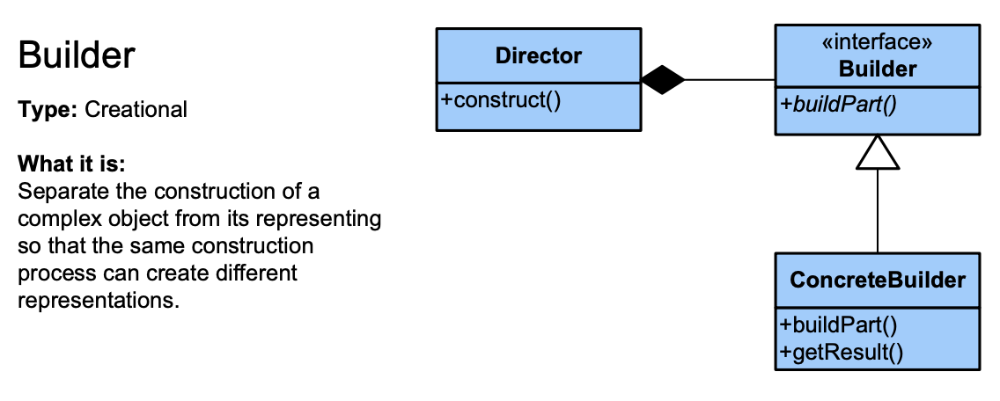

### 빌더 패턴(Builder Pattern)

> *"생성자에 매개변수가 많다면 빌더를 고려하라."*  
> [Effective Java 3/E, p13]

#### 점층적 생성자 패턴(Telescoping Constructor Pattern)
필수 매개변수만 받는 생성자, 필수 매개변수와 선택 매개변수 1개를 받는 생성자, 선택 매개 변수를 2개까지 받는 생서자, ... 형태로 선택 매개변수를 전부 다 받는 생성자까지 늘려가는 방식
~~~java
public class Member {
    private final String name;      // 필수 인자
    private final String location;  // 선택적 인자
    private final String hobby;     // 선택적 인자

    public Member(String name) {
        this(name, "none", "none");
    }

    public Member(String name, String location) {
        this(name, location, "none");
    }

    public Member(String name, String location, String hobby) {
        this.name = name;
        this.location = location;
        this.hobby = hobby;
    }
}
~~~
- 장점  
  1. 필수인자만 지정한 객체 생성이 잦을 경우에는 효율적이다.  

- 단점
  1. 인자가 추가 될 경우 수정이 어렵다.  
  2. 인자가 많아 질 경우 가독성이 떨어진다.

#### 자바빈즈 패턴(JavaBeans Pattern)
매개변수가 없는 생성자를 만든 후, Setter 메서드들을 호출해 원하는 매개변수의 값을 설정하는 방식
~~~java
Member member = new Meber();
member.setName("홍길동");
member.setlocation("죽전");
member.setHobby("영화감");
~~~
- 장점  
  1. 인자가 많더라도 의미를 파악하기 쉽다.
  2. 불필요하고 복잡하게 여러 생성자를 만들 필요가 없다.
- 단점  
  1. 객체 일관성(consistency)이 깨진다. 객체 생성만으로 객체 생성이 끝나지 않고, 이미 생성 된 객체에 지속하여 인자를 변경하여 설정하게 된다.  
  2. 스레드 안정성 확보가 어렵다.

#### 빌더 패턴(Builder Pattern)
~~~java
public class Member {
    private final string name;
    private final string location;
    private final string hobby;
    
    public static class Builder {
        private final string name;
        
        private string location = "none";
        private string hobby = "none";
        
        public Builder(string name) {
            this.name = namel;
        }
        public Builder location(string location) {
            this.location = localtion;
            return this;
        }
        public Builder hobby(string hobby) {
            this.hobby = hobby;
            return this;
        }
        public Member build() {
            return new Member(this);
        }
    }
    
    public Member(Builder builder) {
        name = builder.name;
        location = builder.location;
        hobby = builder.hobby;
    }
}
~~~
~~~java
Member member = new Member.Builder("홍길동")
                        .location("죽전")
                        .hobby("영화감상")
                        .build();
~~~
- 장점
  1. 인자가 많아지더라도 각 인자가 무엇을 의미하는 알기 쉽다.
  2. Setter 메서드가 없으므로 변경 불가능 객체를 만들 수 있다.
  3. 한번에 객체를 생성함으로 객체 일관성을 지킬 수 있다.
  4. build() 함수에서 Validation 검사를 수행하게 하여 입력 값을 검증할 수도 있다.
    
**Lombok을 통한 빌더 패턴**
~~~java
@Builder
public class Member {
    private final int name;
    private final int location;
    private final int hobby;
}
~~~

#### GOF 디자인 패턴의 빌더 패턴
> Separate the construction of a complex object from its representation so that the same construction process can create different representations.  
> 복잡한 객체를 *생성하는 방법*과 *표현하는 방법*을 정의하는 클래스를 별도로 분리하여 서로 다른 표현이라도 이를 생성할 수 있는 동일한 구축 공정을 제공할 수 있도록 한다.

  

- Builder : 빌더 인터페이스.  
- ConcreteBuilder : 빌더 인터페이스 구현체. 부품을 합성하는 방식에 따라 여러 구현체를 만든다.  
- Director : Builder를 사용해 객체를 생성한다.  

~~~java
/** "Product" */
class Pizza {
	private String dough = "";
	private String sauce = "";
	private String topping = "";

	public void setDough(String dough) {
		this.dough = dough;
	}

	public void setSauce(String sauce) {
		this.sauce = sauce;
	}

	public void setTopping(String topping) {
		this.topping = topping;
	}
}

/** "Abstract Builder" */
abstract class PizzaBuilder {
	protected Pizza pizza;

	public Pizza getPizza() {
		return pizza;
	}

	public void createNewPizzaProduct() {
		pizza = new Pizza();
	}

	public abstract void buildDough();

	public abstract void buildSauce();

	public abstract void buildTopping();
}

/** "ConcreteBuilder" */
class HawaiianPizzaBuilder extends PizzaBuilder {
	public void buildDough() {
		pizza.setDough("cross");
	}

	public void buildSauce() {
		pizza.setSauce("mild");
	}

	public void buildTopping() {
		pizza.setTopping("ham+pineapple");
	}
}

/** "ConcreteBuilder" */
class SpicyPizzaBuilder extends PizzaBuilder {
	public void buildDough() {
		pizza.setDough("pan baked");
	}

	public void buildSauce() {
		pizza.setSauce("hot");
	}

	public void buildTopping() {
		pizza.setTopping("pepperoni+salami");
	}
}

/** "Director" */
class Cook {
	private PizzaBuilder pizzaBuilder;

	public void setPizzaBuilder(PizzaBuilder pizzaBuilder) {
		this.pizzaBuilder = pizzaBuilder;
	}

	public Pizza getPizza() {
		return pizzaBuilder.getPizza();
	}

	public void constructPizza() {
		pizzaBuilder.createNewPizzaProduct();
		pizzaBuilder.buildDough();
		pizzaBuilder.buildSauce();
		pizzaBuilder.buildTopping();
	}
}

/** A given type of pizza being constructed. */
public class BuilderExample {
	public static void main(String[] args) {
		Cook cook = new Cook();
		PizzaBuilder hawaiianPizzaBuilder = new HawaiianPizzaBuilder();
		PizzaBuilder spicyPizzaBuilder = new SpicyPizzaBuilder();

		cook.setPizzaBuilder(hawaiianPizzaBuilder);
		cook.constructPizza();

		Pizza pizza = cook.getPizza();
	}
}
~~~

#### Reference
- [Effective Java 3/E - Joshua Bloch](http://www.yes24.com/Product/goods/65551284)
- [Lombok Project @Builder](https://projectlombok.org/features/Builder)
- [Builder Pattern - John Grib](https://johngrib.github.io/wiki/builder-pattern/)
- [Design Pattern Card - JASON MCDONALD](http://www.mcdonaldland.info/)  
- [Builder Pattern(Gof 디자인 패턴) - Thinking Different](https://copynull.tistory.com/131)  
- [Builder Pattern - 나무위키](https://ko.wikipedia.org/wiki/%EB%B9%8C%EB%8D%94_%ED%8C%A8%ED%84%B4)