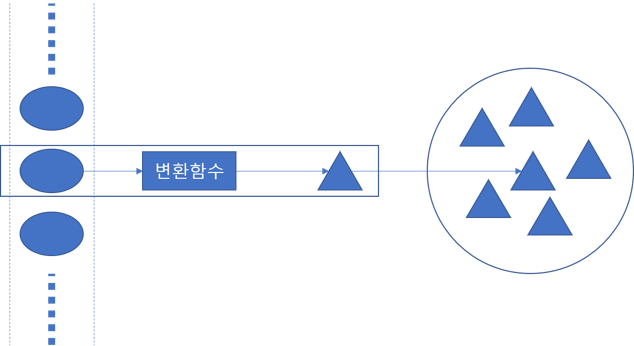

### 스트림으로 데이터 수집

- 컬렉션(Collection) : 목록성 데이터를 처리하는 자료구조, 
Java의 List, Set, Queue는 java.util.Collection 인터페이스를 구현  
- collect : Java 8의 Stream API의 메소드 중 하나로 Collector를 매개변수로 하는 스트림의 최종연산  
- Collector : collect에서 필요한 메서드를 정의해 놓은 인터페이스   
- Collectors : 다양한 기능의 Collector를 구현한 클래스  

스트림에 collect를 호출하면 스트림의 요소에 리듀싱 연산이 수행된다.
  

##### Collectors에서 제공하는 메서드의 기능은 크게 세가지로 구분
- 스트림 요소를 하나의 값으로 리듀스하고 요약
- 요소 그룹화
- 요소 분할

##### Collectors 클래스의 정적 팩토리 메서드  
| *팩토리 메서드* | *반환 형식* | *사용 예제* | *설명* |
|:--------:|:--------:|:--------|:--------|
| toList				| List<T>					| List<Dish> dishes = menuStream.collect(toList());														| 스트림의 모든 항목을 리스트로 수집 |
| toSet					| Set<T>					| Set<Dish> dishes = menuStream.collect(toSet());														| 스트림의 모든 항목을 중복없는 집합으로 수집 |
| toCollection			| Collection<T>				| Collection<Dish> dishes = menuStream.collect(toCollection(), ArrayList::new);							| 스트림의 모든 항목을 공급자가 제공하는 컬렉션으로 수집 |
| counting				| Long						| long howManyDishes = menuStream.collect(counting());													| 스트림의 항목 수 계산 |
| summingInt			| Integer					| int totalCalories = menuStream.collect(summingInt(Dish::getCalories));								| 스트림의 항목에서 정수 프로퍼티 값을 더함 |
| averagingInt			| Double					| double avgCalories = menuStream.collect(averagingInt(Dish::getCalories));								| 스트림 항목의 정수 프로퍼티의 평균값 계산 |
| summarizingInt		| IntSummaryStatistics		| IntSummaryStatistics summary = menuStream.collect(summarizingInt(Dish::getCalories));					| 스트림 내의 항목의 최대, 최소, 합계, 평균 등의 정수 정보 통계를 수집 |
| joining				| String					| String shortMenu = menuStream.map(Dish::getName).collect(joining(“, “));								| 스트림의 각 항목에 toString 메서드를 호출한 결과 문자열을 연결 |
| maxBy					| Optional<T>				| Optional<Dish> fattest = menuStream.collect(maxBy(comparingInt(Dish::getCalories)));					| 주어진 비교자를 이용해서 스트림의 최대값 요소를 Optional로 감싼 값을 반환. 스트림에 요소가 없는경우 Optional.empty() 반환 |
| minBy					| Optional<T>				| Optional<Dish> lightest = menuStream.collect(minBy(comparingInt(Dish::getCalories)));					| 주어진 비교자를 이요해서 스트림의 최소값 요소를 Optional로 감싼 값을 반환. 스트림에 요소가 없는경우 Optional.empty() 반환 |
| reducing				| 리듀싱 연산에서 형식을 결정		| int totalCalories = menuStream.collect(reducing(0, Dish::getCalories, Integer::sum));					| 누적자를 초깃값으로 설정한 다음 BinaryOperator로 스트림의 각 요소를 반복적으로 누적자와 합쳐 스트림을 하나의 값으로 리듀싱 |
| collectingAndThen		| 변환함수가 형식을 반환			| int howManyDishes = menuStream.collect(collectingAndThen(toList(), List::size));						| 다른 컬렉터를 감싸고 그 결과에 변환 함수를 적용 |
| groupingBy			| Map<K, List<T>>			| Map<Dish.Type, List<Dish>> dishesByType = menuStream.collect(groupingBy(Dish::getType), toList()); 	| 하나의 프로퍼티값을 기준으로 스트림의 항목을 그룹화하며 기준 프로퍼티값을 결과 맵의 키로 사용 |
| partitioningBy		| Map<Boolean, List<T>>		| Map<Boolean, List<Dish>> vegetarianDishes = menuStream.collect(partitioningBy(Dish::isVegetarian));	| 프레디케이트를 스트림의 각 항목에 적용한 결과로 항목을 분할 |

##### Collector 인터페이스
~~~java
public interface Collector<T, A, R> {
    Supplier<A> supplier();
    BiConsumer<A, T> accumulator();
    BinaryOperator<A> combiner();
    Function<A, R> finisher();
    Set<Collector.Characteristics> characteristics();
}
~~~
**1. supplier 메서드 : 새로운 결과 컨테이너 만들기**  
supplier 메서드는 빈 결과로 이루어진 Supplier를 반환해야 함, 즉, supplier는 수집 과정에서 빈 누적자 인스턴스를 만드는 파라미터가 없는 함수다.  
**2. accumulator 메서드 : 결과 컨테이너에 요소 추가하기**  
accumulator 메서드는 리듀싱 연산을 수행하는 함수를 반환 한다. 스트림에서 n번째 요소를 탐색할 때 두 인수, 즉 누적자와 n번째 요소를 함수에 적용한다. 함수의 반환값은 void, 즉 요소를 탐색하면서 적용하는 함수에 의해 누적자 내부 상태가 바뀌므로 누적자가 어떤 값일지 단정할 수 없다.  
**3. finisher 메서드 : 최종 변환값을 결과 컨테이너로 적용하기**  
finisher 메서드는 스트림 탐색을 끝내고 누적자 객체를 최종 결과로 변환하면서 누적과정을 끝낼 때 호출할 함수를 반환해야 한다.  
**4. combiner 메서드 : 두 결과 컨테이너 병합**  
combiner는 스트림의 서로 다른 서브파트를 병렬로 처리할 때 누적자가 이 결과를 어떻게 처리할지를 정의한다.  
**5. Characteristics 메서드**  
Characteristics는 스트림을 병렬로 리듀스할 것인지 그리고 병렬로 리듀스한다면 어떤 최적화를 선택해야 할지 힌트를 제공한다.  
- UNORDERED  
리듀싱 결과는 스트림 요소의 방문 순서나 누적 순서에 영향을 받지 않는다.
- CONCURRENT  
다중 스레드에서 accumulator 함수를 동시에 호출할 수 있으며 이 컬렉터는 스트림의 병렬 리듀싱을 수행할 수 있다. 컬렉터의 플래그에 UNORDERED를 함꼐 설정하지 않았다면 데이터 소스가 정렬되어 있지 않은 상황에서만 병렬 리듀싱을 수행할 수 있다.
- IDENTITY_FINISH  
리듀싱 과정의 최종결과로 누적자 객체를 바로 사용할 수 있다. 또한 누적자 A를 결과 R로 안전하게 형변환 할 수 있다.

#### Reference
[collect(), Collector, Collectors](https://napasun-programming.tistory.com/39)  
[정적팩토리 메서드 - John Grib](https://johngrib.github.io/wiki/static-factory-method-pattern/)