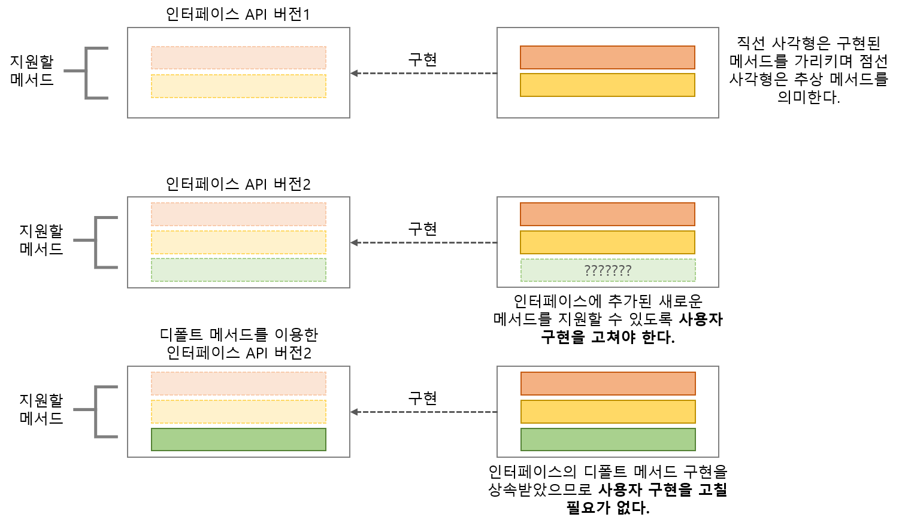

## 디폴트 메서드

자바 8 이전에는 인터페이스를 구현하는 클래스는 인터페이스에서 
정의하는 모든 메서드 구현을 제공하거나 아니면 슈퍼클래스의 구현을 상속받아야한다.  
**인터페이스를 바꾸고 싶을 때 문제 발생**  

디폴트 메서드를 이용하면 자바 API의 호환성을 유지하면서 라이브러리를 바꿀 수 있다.  

  

_※인터페이스에 새로운 메서드를 추가하면 바이너리 호환성은 유지된다._  

#### 디폴트 메서드 활용 패턴
- 선택형 메서드
  - 사용자들이 잘 사용하지 않는 기능도 인터페이스에 정의되어 있다면 기존에는 비어놓은채로 구현해야 함  
  - 디폴트 메서드를 사용함으로써 불필요한 코드 제거  
- 동작 다중 상속
  - 인터 페이스 조합을 통해 기능이 중복되지 않는 최소의 인터페이스를 정의하여, 다중상속 지원이 가능  
  - 옳지 못한 상속 : 한 개의 메서드를 재사용 하려고 100개의 메서드와 필드가 정의되어 있는 클래스를 상속하는 것은 좋은 생각이 아니다. 
  이럴때는 델리게이션(delegation), 즉 멤버 변수를 이용해서 클래스에서 필요한 메서드를 직접 호출하는 메서드를 작성하는 것이 좋다.  

#### 인터페이스 해석 규칙
1. **클래스가 항상 이긴다.** 클래스나 슈퍼클래스에서 정의한 메서드가 디폴트 메서드보다 우선권을 갖는다.  
2. **1번 규칙 이외의 상황에서는 서브인터페이스가 이긴다.** 상속관계를 갖는 인터페이스에서 
같은 시그니처를 갖는 메서드를 정의할 때는 서브인터페이스가 이긴다. 즉 B가 A를 상속 받는다면 B가 A를 이긴다.  
3. 여전히 디폴트 메서드의 **우선순위가 결정되지 않았다면 여러 인터페이스를 상속받는 클래스가 
명시적으로 디폴트 메서드를 오버라이드하고 호출해야 한다.**  