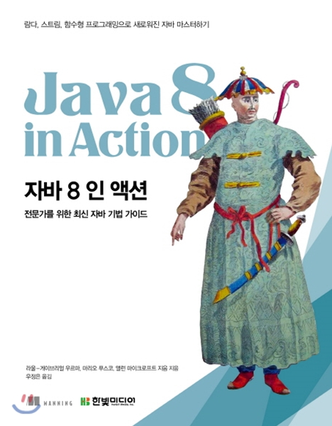

# 자바8인액션(Java 8 In Action)
   
라울-게이브리얼 우르마, 마리오 푸스코, 앨런 마이크로프트 공저 / 우정은 역  
한빛미디어  

#### 1부 기초  
---
- [1장. 자바 8을 눈여겨봐야 하는 이유](Chapter1/자바8을눈여겨봐야하는이유.md)  
- [2장. 동작 파라미터화 코드 전달하기](Chapter2/동작파라미터화코드전달하기.md)  
- [3장. 람다 표현식](Chapter3/자바8인액션-람다표현식.md)
  - [Lazy Evaluation](Chapter3/Lambda_Lazy_Evaluation.md)  
  - [Lambda Variable Test](Chapter3/Lambda_Variable_Test.md)

#### 2부 함수형 데이터 처리  
---
- [4장. 스트림 소개](Chapter4/스트림소개.md)
  - [빌더 패턴(Builder Pattern) - John Grib](https://johngrib.github.io/wiki/builder-pattern)
- [5장. 스트림 활용](Chapter5/스트림활용.md)  
- 6장. 스트림과 데이터 수집  
- 7장. 병렬 데이터 처리와 성능  

#### 3부 효과적인 자바 8 프로그래밍  
---
- 8장. 리팩토링, 테스팅, 디버깅  
- 9장. 디폴트 메서드  
- 10장. null 대신 Optional  
- 11장. CompletableFuture: 조합할 수 있는 비동기 프로그래밍  
- 12장. 새로운 날짜, 시간 API  

#### 4부 자바 8의 한계를 넘어서  
---
- 13장. 함수형 관점으로 생각하기  
- 14장. 함수형 프로그래밍 기법  
- 15장. OOP와 FP의 조화: 자바 8과 스칼라 비교  
- 16장. 결론 그리고 자바의 미래   
